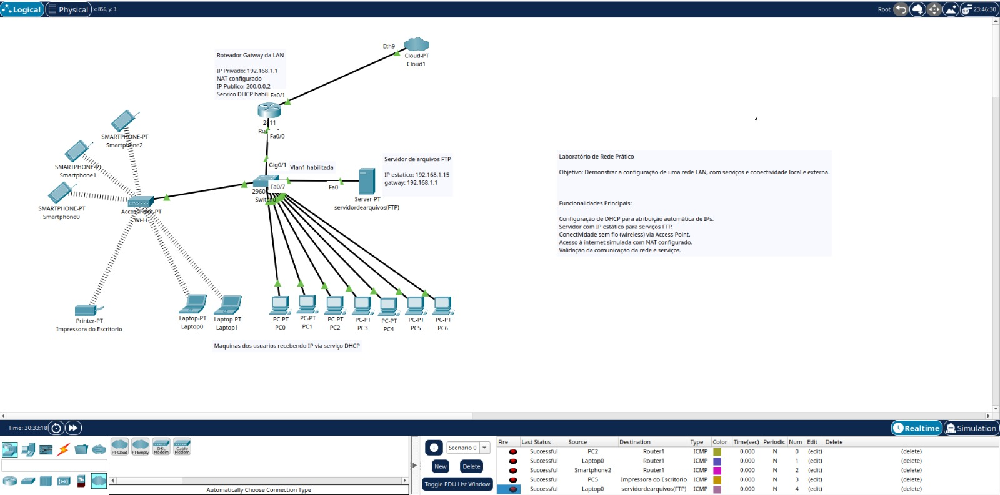
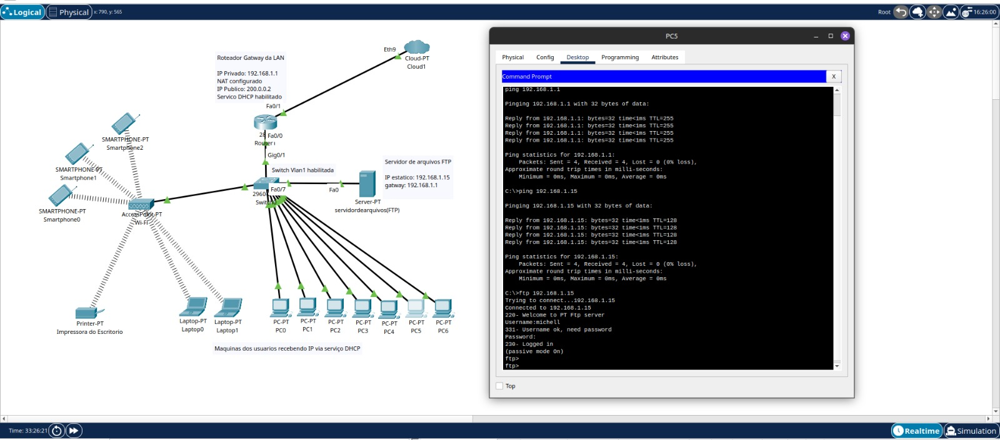
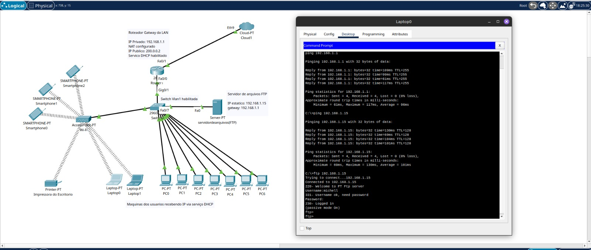
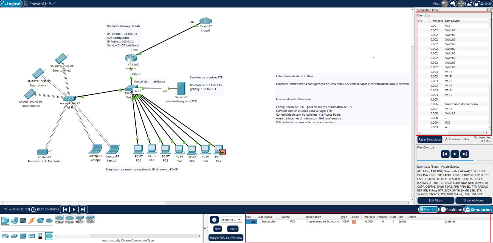

# 🏛️ Sadalla Advogados Associados — Projeto de Rede LAN

Este projeto foi desenvolvido no **Cisco Packet Tracer** para simular a infraestrutura de rede de um escritório de advocacia fictício:  
**Sadalla Advogados Associados**.

---

## 📖 Contexto

O escritório está em fase de expansão e precisou de uma **infraestrutura de rede local (LAN)** que ofereça:

- Conectividade confiável para advogados, estagiários e equipe administrativa.
- Impressão em rede acessível para todos os colaboradores.
- Servidor de arquivos centralizado para documentos jurídicos.
- Acesso Wi-Fi para dispositivos móveis.

---

## 🖥️ Topologia da Rede

A topologia foi criada no Cisco Packet Tracer e representa a infraestrutura básica do escritório.



### 🔹 Principais elementos:

- **Roteador 2811** — Roteador principal que gerencia a rede LAN e a conexão com a internet.
- **Switch 2960** — distribui a conexão entre os dispositivos.
- **Access Point** — fornece conectividade Wi-Fi para smartphones e laptops.
- **Servidor FTP** — central de documentos jurídicos do escritório.
- **Impressora de Escritório** — compartilhada em rede.
- **Estações de Trabalho (PCs)** — para advogados e equipe administrativa.
- **Laptops e Smartphones** — dispositivos móveis para mobilidade.

---

## 🔐 Serviços Configurados

- **Servidor FTP**: centraliza e organiza documentos jurídicos e administrativos.
- **Impressora em Rede**: disponível para todos os usuários da LAN.
- **DHCP**: Configurado para automatizar a entrega de IPs.
- **NAT e Internet**: Configurado simulando integração externa.

---

## 🎯 Objetivos do Projeto

- Criar uma rede **estável e segura** para suportar o crescimento do escritório.
- Garantir **colaboração eficiente** através do servidor de arquivos.
- Prover **mobilidade** via Wi-Fi.
- Manter **boa escalabilidade**, permitindo adicionar Rede ISP em fases futuras.

---

## 📂 Estrutura do Repositório

- `rede_sadalla.pkt` → Arquivo do Cisco Packet Tracer com a topologia pronta.
- `README.md` → Documentação do projeto.
- `imagens/` → Pasta com capturas de tela dos testes e diagramas.
  - `topologia.jpeg` → Imagem ilustrativa da rede.
  - `imagens/teste-LAPTOP-conectividade-e-FTP.jpeg` → Teste de ping (gateway e servidor FTP) e acesso FTP a partir do PC5.
  - `imagens/teste-PC5-conectividade-e-FTP.jpeg` → Teste de ping (gateway e servidor FTP) e acesso FTP a partir do PC5.

---

## 🚀 Como abrir o projeto para testar a conectividade da Rede

1. Instale o [Cisco Packet Tracer](https://www.netacad.com/courses/packet-tracer) (versão **8.2 ou superior**).
2. Clone este repositório:
   ```bash
   git clone https://github.com/SEU-USUARIO/NOME-DO-REPO.git
   cd NOME-DO-REPO
   ```

---

## 📡 Testes de Conectividade e Acesso

Para validar a configuração da rede e garantir a comunicação entre os dispositivos e o servidor, foram realizados testes de conectividade e autenticação via FTP.

---

### 🖥️ Teste no PC5

- ✅ Ping para o **Gateway** (`192.168.1.1`)
- ✅ Ping para o **Servidor FTP** (`192.168.1.15`)
- ✅ Acesso ao **Servidor FTP** com autenticação bem-sucedida

📷 Resultado do teste:



---

### 🖥️ Teste no LAPTOP

- ✅ Ping para o **Gateway** (`192.168.1.1`)
- ✅ Ping para o **Servidor FTP** (`192.168.1.15`)
- ✅ Acesso ao **Servidor FTP** com autenticação bem-sucedida

📷 Resultado do teste:



---

### 🖥️ Teste de acesso a impressora remota

- ✅ Teste feito via ferramenta de simulação de tráfego no Packet Tracer

📷 Resultado do teste:


